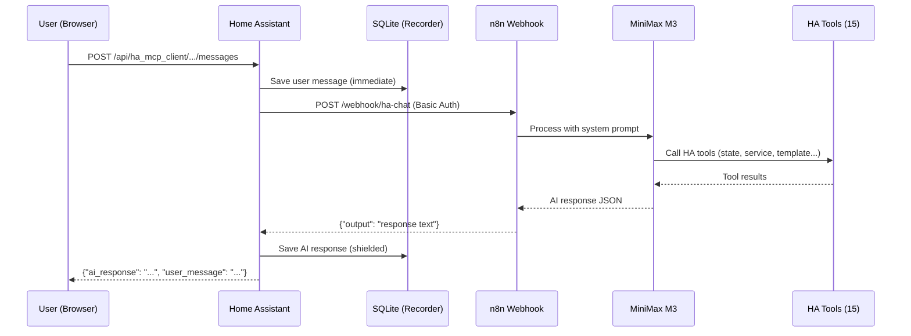
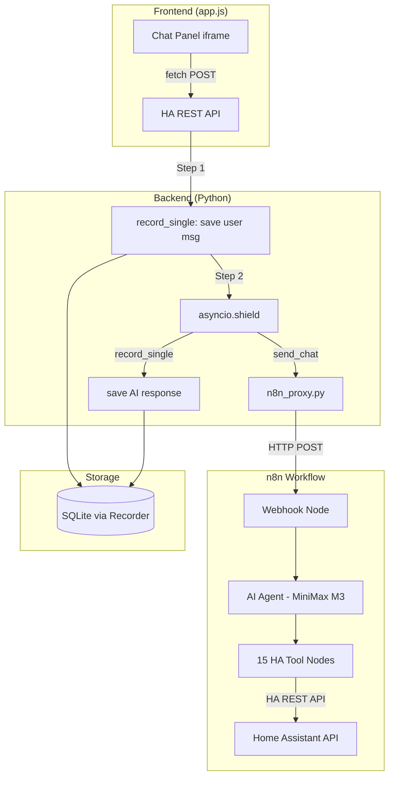

<p align="center">
  
</p>
<h1 align="center">Woow HA MCP Chatbot</h1>
<p align="center">
  <strong>AI-Powered Smart Home Chat Panel for Home Assistant</strong><br/>
  Natural language control of 800+ entities via n8n + MiniMax M3 AI Agent
</p>

<p align="center">
  <a href="#features">Features</a> &bull;
  <a href="#architecture">Architecture</a> &bull;
  <a href="#screenshots">Screenshots</a> &bull;
  <a href="#installation">Installation</a> &bull;
  <a href="#configuration">Configuration</a> &bull;
  <a href="#api-reference">API Reference</a> &bull;
  <a href="#testing">Testing</a> &bull;
  <a href="#changelog">Changelog</a> &bull;
  <a href="README_zh-TW.md">中文文件</a>
</p>

<p align="center">
  
  
  
  
  
  
</p>

---

## Overview

Woow HA MCP Chatbot adds a dedicated **AI Chat Panel** to your Home Assistant sidebar. It connects to an **n8n workflow** running a **MiniMax M3 AI Agent** with **15 Home Assistant tool nodes**, enabling natural language control of your entire smart home — lights, climate, covers, scenes, automations, media players, and more.

Unlike built-in voice assistants, this integration provides a full **chat interface** with conversation history, multi-turn context, and detailed feedback on every action taken.

<p align="center">
  
</p>

---

## Features

### AI Chat Panel
- Dedicated sidebar panel ("AI 聊天") integrated into Home Assistant
- Multi-conversation management with search and auto-titling
- Persistent conversation history stored in HA's recorder database
- Responsive design — works on desktop, tablet, and mobile
- Dark/light theme sync from Home Assistant parent frame

### Smart Home Control via Natural Language
- **15 HA tool nodes** in n8n covering all major domains
- Query entity states, control lights/climate/covers, trigger scenes & automations
- Jinja2 template rendering for advanced queries (counts, filters, aggregations)
- Service calls with parameters (brightness, color, temperature, position)
- Logbook, event history, error log, and camera screenshot access

### Enterprise-Grade Reliability
- **Message persistence first** — user messages saved to DB before calling AI
- **Cloudflare timeout resilience** — `asyncio.shield()` protects long-running operations
- **n8n webhook reconnection** — automatic re-activation after pod restarts
- UTC timestamp normalization for correct display across timezones

---

## Architecture

### System Flow

```
┌─────────────────────────────────────────────────────────────┐
│                    Home Assistant                            │
│                                                             │
│  ┌──────────┐    ┌──────────┐    ┌───────────────────┐     │
│  │  Chat    │───▶│ views.py │───▶│  n8n_proxy.py     │     │
│  │  Panel   │    │ REST API │    │  (HTTP + BasicAuth)│     │
│  │ (iframe) │◀───│          │◀───│                   │     │
│  └──────────┘    └──────────┘    └─────────┬─────────┘     │
│       │               │                     │               │
│       │          ┌──────────┐               │               │
│       │          │ recorder │               │               │
│       │          │ (SQLite) │               │               │
│       │          └──────────┘               │               │
└───────│─────────────────────────────────────│───────────────┘
        │                                     │
        │                                     ▼
        │                        ┌────────────────────┐
        │                        │   n8n Workflow      │
        │                        │                    │
        │                        │  Webhook (POST)    │
        │                        │       │            │
        │                        │       ▼            │
        │                        │  AI Agent          │
        │                        │  (MiniMax M3)      │
        │                        │       │            │
        │                        │       ▼            │
        │                        │  15 HA Tool Nodes  │
        │                        │  + Simple Memory   │
        │                        └────────────────────┘
        │
        ▼
   ┌──────────┐
   │ Browser  │  (Desktop / Mobile / Tablet)
   └──────────┘
```

### Mermaid Diagram



### Data Flow Diagram



---

## n8n Workflow — 15 HA Tool Nodes

The n8n workflow `[HA Chat] AI 管家 v2` contains these tool nodes:

| # | Tool Node | Resource | Operation | Description |
|---|-----------|----------|-----------|-------------|
| 1 | HA_State_Get | state | get | Query a single entity state |
| 2 | HA_State_GetMany | state | getAll | List multiple entity states (up to 100) |
| 3 | HA_State_Upsert | state | upsert | Override entity state value (use with caution) |
| 4 | HA_Service_Call | service | call | Simple service call (turn_on, turn_off, toggle) |
| 5 | HA_Service_Call_Ex | service | call | Service call with extra params (brightness, color, temp) |
| 6 | HA_Service_GetMany | service | getAll | List available services for a domain |
| 7 | HA_Template_Render | template | render | Render Jinja2 templates (most powerful query tool) |
| 8 | HA_Logbook_GetMany | log | getLogbookEntries | Query event records |
| 9 | HA_ErrorLog_GetMany | log | getErrorLogs | Query system error logs |
| 10 | HA_Event_Create | event | create | Fire custom events |
| 11 | HA_Event_GetMany | event | getAll | List available event types |
| 12 | HA_Config_Get | config | get | Get system configuration |
| 13 | HA_Config_Check | config | check | Validate configuration files |
| 14 | HA_CameraProxy_Screenshot | cameraProxy | getScreenshot | Capture camera screenshots |
| 15 | HA_History_GetMany | history | getAll | Query historical state changes |

### AI System Prompt

The AI agent operates as "E&L 智慧宅 AI 管家" (Smart Home AI Butler) with these behavior rules:
- **Query first, act second** — always verify entity IDs before executing commands
- **Verify after action** — check state after service calls, report specific values
- **Direct execution** — reversible operations (lights, scenes) executed without confirmation
- **Safety guard** — `HA_State_Upsert` always requires user confirmation
- **Stay in scope** — only handles Home Assistant operations

---

## Screenshots

### Desktop — Welcome Screen

<p align="center">
  
</p>

### Desktop — AI Conversation

<p align="center">
  
</p>

### Mobile — Chat View

<p align="center">
  
</p>

### Mobile — Sidebar Navigation

<p align="center">
  
</p>

---

## Installation

### HACS (Recommended)

1. In HACS, go to **Integrations** → **⋮** (overflow menu) → **Custom repositories**
2. Add `WOOWTECH/Woow_ha_mcp_chatbot` as type **Integration**
3. Search for **"HA MCP Client"** and click **Download**
4. **Restart Home Assistant**
5. Go to **Settings → Devices & Services → Add Integration → HA MCP Client**

### Manual

1. Copy `custom_components/ha_mcp_client/` to your HA `config/custom_components/` directory
2. Restart Home Assistant
3. Go to **Settings → Devices & Services → Add Integration → HA MCP Client**

---

## Configuration

### Prerequisites

Before configuring the HA integration, you need:

1. **n8n instance** with the `[HA Chat] AI 管家 v2` workflow deployed and active
2. **MiniMax API key** (for the AI Agent node)
3. **HA Long-Lived Access Token** (for the 15 HA tool nodes)
4. **Basic Auth credentials** configured on the n8n Webhook node

### Setup Wizard (3 Steps)

| Step | Fields | Description |
|------|--------|-------------|
| 1. n8n Connection | Base URL, API Key (optional) | n8n instance URL. API key enables auto-discovery of chat workflows |
| 2. Webhook Path | Webhook path | Production webhook path (e.g., `webhook/ha-chat`) |
| 3. Authentication | Username, Password | Basic Auth credentials matching the n8n Webhook node |

### n8n Connection Notes

| Scenario | n8n URL to use |
|----------|---------------|
| n8n in same K8s cluster | `http://n8n.<namespace>.svc.cluster.local:5678` |
| n8n on same LAN | `http://<node-ip>:<nodeport>` (e.g., `http://192.168.2.191:30678`) |
| n8n via Cloudflare | `https://n8n.yourdomain.com` (⚠️ 100s timeout limit) |

---

## API Reference

### Conversations

| Method | Endpoint | Description |
|--------|----------|-------------|
| `GET` | `/api/ha_mcp_client/conversations` | List all conversations (sorted by updated_at desc) |
| `POST` | `/api/ha_mcp_client/conversations` | Create a new conversation |
| `PATCH` | `/api/ha_mcp_client/conversations/{id}` | Rename or archive a conversation |
| `DELETE` | `/api/ha_mcp_client/conversations/{id}` | Soft-delete a conversation |

### Messages

| Method | Endpoint | Description |
|--------|----------|-------------|
| `GET` | `/api/ha_mcp_client/conversations/{id}/messages` | Get messages (supports `?limit=50&offset=0`) |
| `POST` | `/api/ha_mcp_client/conversations/{id}/messages` | Send a message and get AI response |

### Send Message — Request & Response

```json
// POST /api/ha_mcp_client/conversations/{id}/messages
// Request:
{"message": "把客廳的燈打開亮度50%"}

// Response:
{
  "user_message": "把客廳的燈打開亮度50%",
  "ai_response": "已完成 ✅ 客廳燈已打開，亮度設定為 50%。",
  "conversation_id": "uuid-..."
}
```

### Services

| Service | Description |
|---------|-------------|
| `ha_mcp_client.clear_conversation_history` | Clear all conversation history for a user |
| `ha_mcp_client.export_conversation_history` | Export history as JSON or Markdown |

---

## Project Structure

```
Woow_ha_mcp_chatbot/
├── README.md                    # English documentation
├── README_zh-TW.md              # 繁體中文文件
├── LICENSE                      # MIT License
├── hacs.json                    # HACS integration metadata
├── .gitignore                   # Git ignore rules
│
├── custom_components/ha_mcp_client/
│   ├── __init__.py              # Integration setup, panel registration, services
│   ├── config_flow.py           # 3-step configuration wizard
│   ├── const.py                 # Constants and configuration keys
│   ├── n8n_proxy.py             # n8n webhook HTTP client (Basic Auth)
│   ├── views.py                 # REST API endpoints (6 routes)
│   ├── conversation_recorder.py # SQLite-based conversation history
│   ├── manifest.json            # Integration metadata (v1.0.0)
│   ├── services.yaml            # Service definitions
│   ├── strings.json             # Default UI strings
│   │
│   ├── brand/                   # Brand assets
│   │   ├── icon.png / icon@2x.png
│   │   └── logo.png / logo@2x.png
│   │
│   ├── frontend/                # Chat panel UI
│   │   ├── index.html           # Panel HTML template
│   │   ├── app.js               # Frontend logic (vanilla JS)
│   │   └── styles.css           # CSS with HA theme sync
│   │
│   └── translations/            # Localization
│       ├── en.json              # English
│       └── zh-Hant.json         # Traditional Chinese
│
└── docs/
    ├── screenshots/             # README images
    └── plans/                   # Design & planning documents
```

---

## Testing

### Test Results (50-Conversation AI Agent Test)

| Category | Tests | Pass | Rate |
|----------|-------|------|------|
| Basic Queries (entity, config, zones) | 5 | 5 | 100% |
| Light Control (on/off/brightness/color) | 5 | 5 | 100% |
| Climate / Cover | 5 | 4 | 80% |
| Scene / Automation | 5 | 4 | 80% |
| Template Queries (Jinja2) | 5 | 5 | 100% |
| Multi-param Service Calls | 5 | 4 | 80% |
| Error Handling (invalid entities) | 5 | 5 | 100% |
| Multi-turn Context | 5 | 5 | 100% |
| Logbook / Events | 5 | 4 | 80% |
| Edge Cases (emoji, long text) | 5 | 3 | 60% |
| **Total** | **50** | **44** | **88%** |

### API-Level Tests (24 Tests)

| Group | Tests | Pass |
|-------|-------|------|
| Authentication (401/403) | 3 | 3 |
| Conversation CRUD | 8 | 8 |
| Messages API | 8 | 8 |
| Edge Cases | 5 | 5 |
| **Total** | **24** | **24 (100%)** |

---

## Changelog

### v1.0.0 (2026-07)

**Major refactor: n8n webhook integration**

- Replaced built-in AI services (OpenAI, Anthropic, Ollama) with n8n Webhook + MiniMax M3
- Removed MCP server, nanobot/cron modules, 62-tool registry
- Added `n8n_proxy.py` for single JSON request/response
- 3-step config flow: n8n URL → webhook path → Basic Auth
- Message persistence: user message saved before n8n call
- Cloudflare 524 timeout resilience with `asyncio.shield()`
- UTC timestamp normalization (Z suffix)
- Service call split: `HA_Service_Call` (simple) + `HA_Service_Call_Ex` (with params)
- 50-conversation enterprise test suite

### v0.1.0 (2026-03)

- Initial release with built-in AI providers
- 62 smart home tools
- MCP SSE server
- Chat panel with conversation history

---

## Support

- **Issues**: [GitHub Issues](https://github.com/WOOWTECH/Woow_ha_mcp_chatbot/issues)
- **Documentation**: [GitHub Repository](https://github.com/WOOWTECH/Woow_ha_mcp_chatbot)
- **Author**: [WOOWTECH](https://github.com/WOOWTECH)

---

## License

[MIT License](LICENSE) — see LICENSE file for details.

---

<p align="center">
  <sub>Built with ❤️ by <strong>WOOWTECH</strong> · Powered by Home Assistant + n8n + MiniMax M3</sub>
</p>
