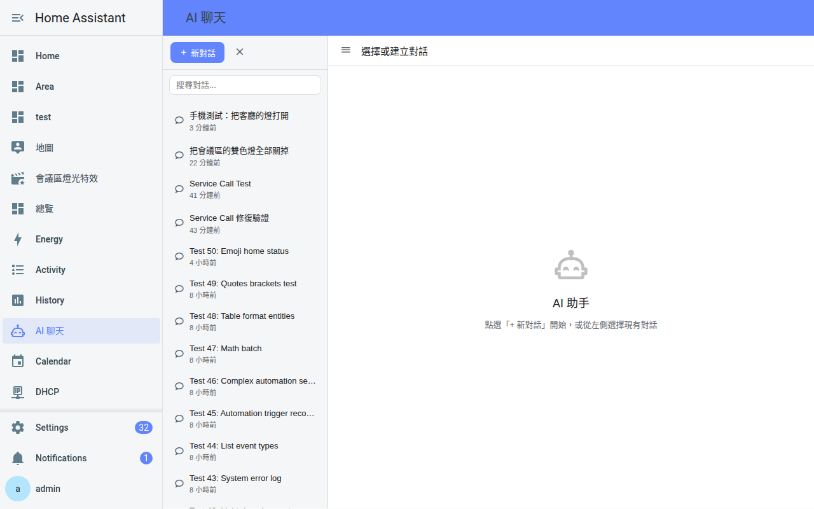
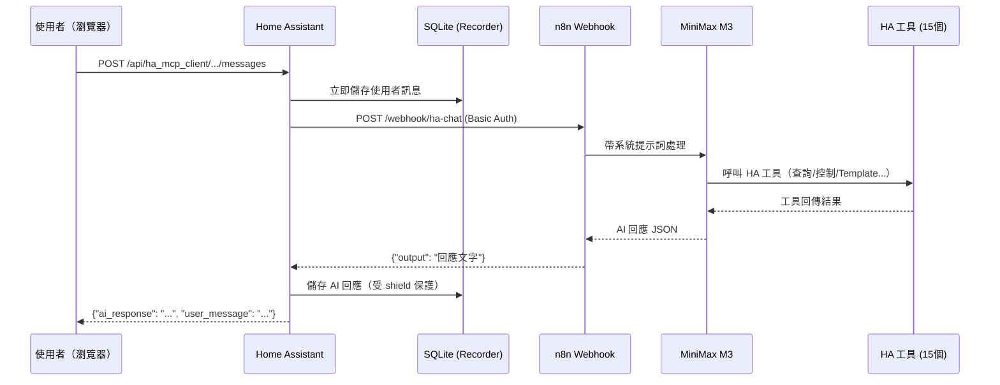
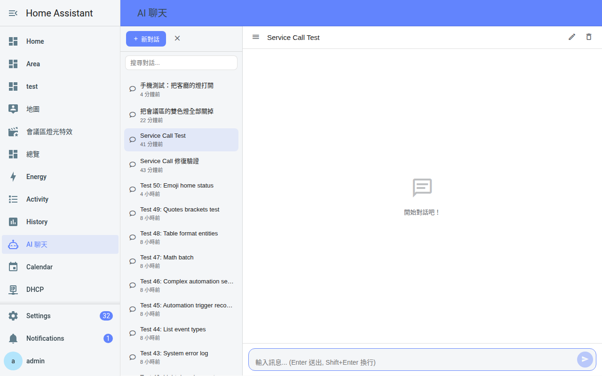
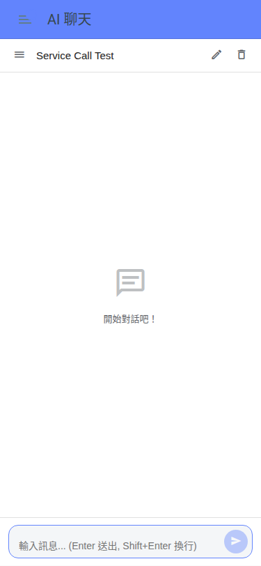
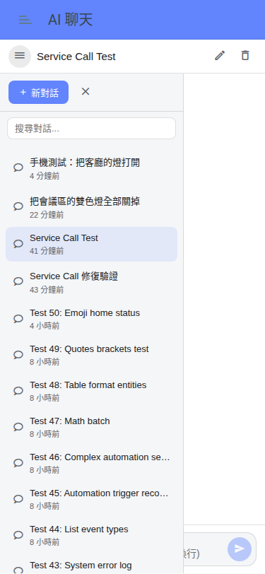

<p align="center">
  
</p>
<h1 align="center">Woow HA MCP Chatbot</h1>
<p align="center">
  <strong>Home Assistant AI 智慧家庭聊天面板</strong><br/>
  透過 n8n + MiniMax M3 AI 代理，以自然語言控制 800+ 個設備
</p>

<p align="center">
  <a href="#功能特色">功能特色</a> &bull;
  <a href="#系統架構">系統架構</a> &bull;
  <a href="#截圖展示">截圖展示</a> &bull;
  <a href="#安裝方式">安裝方式</a> &bull;
  <a href="#設定說明">設定說明</a> &bull;
  <a href="#api-參考">API 參考</a> &bull;
  <a href="#測試報告">測試報告</a> &bull;
  <a href="#更新日誌">更新日誌</a> &bull;
  <a href="README.md">English</a>
</p>

<p align="center">
  
  
  
  
  
  
</p>

---

## 概覽

Woow HA MCP Chatbot 為你的 Home Assistant 側邊欄加入一個專屬的 **AI 聊天面板**。它連接到 **n8n 工作流程**，運行 **MiniMax M3 AI 代理** 配合 **15 個 Home Assistant 工具節點**，讓你用自然語言控制整個智慧家庭——燈光、空調、窗簾、情境、自動化、媒體播放器等。

與內建語音助手不同，這個整合提供完整的**聊天介面**，支援對話歷史、多輪上下文記憶，以及每次操作的詳細回報。

<p align="center">
  
</p>

---

## 功能特色

### AI 聊天面板
- 專屬側邊欄面板（「AI 聊天」），直接整合在 Home Assistant 內
- 多對話管理，支援搜尋與自動標題
- 持久化對話歷史，儲存在 HA 的 recorder 資料庫
- 響應式設計——桌面、平板、手機都能用
- 自動同步 Home Assistant 的深色/淺色主題

### 自然語言智慧家庭控制
- n8n 中的 **15 個 HA 工具節點**，覆蓋所有主要 domain
- 查詢 entity 狀態、控制燈光/空調/窗簾、觸發情境與自動化
- Jinja2 template 渲染進階查詢（計數、篩選、聚合）
- 帶參數的 service call（亮度、顏色、溫度、位置）
- Logbook、事件歷史、錯誤日誌、攝影機截圖

### 企業級可靠性
- **訊息優先儲存**——使用者訊息在呼叫 AI 之前就存入資料庫
- **Cloudflare 超時防護**——`asyncio.shield()` 保護長時間操作
- **n8n webhook 自動重連**——Pod 重啟後自動重新啟用
- UTC 時間戳正規化，確保跨時區正確顯示

---

## 系統架構

### 系統流程

```
┌─────────────────────────────────────────────────────────────┐
│                    Home Assistant                            │
│                                                             │
│  ┌──────────┐    ┌──────────┐    ┌───────────────────┐     │
│  │  聊天    │───▶│ views.py │───▶│  n8n_proxy.py     │     │
│  │  面板    │    │ REST API │    │  (HTTP + BasicAuth)│     │
│  │ (iframe) │◀───│          │◀───│                   │     │
│  └──────────┘    └──────────┘    └─────────┬─────────┘     │
│       │               │                     │               │
│       │          ┌──────────┐               │               │
│       │          │ recorder │               │               │
│       │          │ (SQLite) │               │               │
│       │          └──────────┘               │               │
└───────│─────────────────────────────────────│───────────────┘
        │                                     │
        │                                     ▼
        │                        ┌────────────────────┐
        │                        │   n8n 工作流程      │
        │                        │                    │
        │                        │  Webhook (POST)    │
        │                        │       │            │
        │                        │       ▼            │
        │                        │  AI Agent          │
        │                        │  (MiniMax M3)      │
        │                        │       │            │
        │                        │       ▼            │
        │                        │  15 個 HA 工具節點  │
        │                        │  + Simple Memory   │
        │                        └────────────────────┘
        │
        ▼
   ┌──────────┐
   │ 瀏覽器   │  (桌面 / 手機 / 平板)
   └──────────┘
```

### Mermaid 互動圖



---

## n8n 工作流程——15 個 HA 工具節點

| # | 工具節點 | 資源 | 操作 | 說明 |
|---|---------|------|------|------|
| 1 | HA_State_Get | state | get | 查詢單一 entity 狀態 |
| 2 | HA_State_GetMany | state | getAll | 列出多個 entity 狀態（最多 100 筆） |
| 3 | HA_State_Upsert | state | upsert | 覆寫 entity 狀態值（謹慎使用） |
| 4 | HA_Service_Call | service | call | 簡單 service 呼叫（開/關/切換） |
| 5 | HA_Service_Call_Ex | service | call | 帶額外參數的 service 呼叫（亮度、顏色、溫度） |
| 6 | HA_Service_GetMany | service | getAll | 列出某 domain 可用的 service |
| 7 | HA_Template_Render | template | render | 渲染 Jinja2 template（最強查詢工具） |
| 8 | HA_Logbook_GetMany | log | getLogbookEntries | 查詢事件記錄 |
| 9 | HA_ErrorLog_GetMany | log | getErrorLogs | 查詢系統錯誤日誌 |
| 10 | HA_Event_Create | event | create | 觸發自訂事件 |
| 11 | HA_Event_GetMany | event | getAll | 列出可用事件類型 |
| 12 | HA_Config_Get | config | get | 取得系統設定 |
| 13 | HA_Config_Check | config | check | 驗證設定檔語法 |
| 14 | HA_CameraProxy_Screenshot | cameraProxy | getScreenshot | 擷取攝影機截圖 |
| 15 | HA_History_GetMany | history | getAll | 查詢歷史狀態變化 |

---

## 截圖展示

### 桌面——歡迎畫面

<p align="center">
  
</p>

### 桌面——AI 對話

<p align="center">
  
</p>

### 手機——聊天介面

<p align="center">
  
</p>

### 手機——側邊欄導覽

<p align="center">
  
</p>

---

## 安裝方式

### HACS（建議）

1. 在 HACS 中，前往 **整合** → **⋮**（選單）→ **自訂儲存庫**
2. 新增 `WOOWTECH/Woow_ha_mcp_chatbot`，類型選 **Integration**
3. 搜尋 **「HA MCP Client」** 並點擊 **下載**
4. **重啟 Home Assistant**
5. 前往 **設定 → 裝置與服務 → 新增整合 → HA MCP Client**

### 手動安裝

1. 將 `custom_components/ha_mcp_client/` 複製到 HA 的 `config/custom_components/` 目錄
2. 重啟 Home Assistant
3. 前往 **設定 → 裝置與服務 → 新增整合 → HA MCP Client**

---

## 設定說明

### 前置需求

1. **n8n 執行個體**，已部署並啟用 `[HA Chat] AI 管家 v2` 工作流程
2. **MiniMax API Key**（給 AI Agent 節點用）
3. **HA 長效存取 Token**（給 15 個 HA 工具節點用）
4. **Basic Auth 帳密**（設定在 n8n Webhook 節點上）

### 設定精靈（3 步驟）

| 步驟 | 欄位 | 說明 |
|------|------|------|
| 1. n8n 連線 | Base URL、API Key（選填） | n8n 執行個體 URL。提供 API key 可自動探索聊天工作流程 |
| 2. Webhook 路徑 | Webhook path | 正式環境的 webhook 路徑（例如 `webhook/ha-chat`） |
| 3. 認證 | 帳號、密碼 | 與 n8n Webhook 節點設定一致的 Basic Auth 帳密 |

---

## API 參考

### 對話管理

| 方法 | 端點 | 說明 |
|------|------|------|
| `GET` | `/api/ha_mcp_client/conversations` | 列出所有對話（按更新時間倒序） |
| `POST` | `/api/ha_mcp_client/conversations` | 建立新對話 |
| `PATCH` | `/api/ha_mcp_client/conversations/{id}` | 重新命名或封存對話 |
| `DELETE` | `/api/ha_mcp_client/conversations/{id}` | 軟刪除對話 |

### 訊息

| 方法 | 端點 | 說明 |
|------|------|------|
| `GET` | `/api/ha_mcp_client/conversations/{id}/messages` | 取得訊息（支援 `?limit=50&offset=0`） |
| `POST` | `/api/ha_mcp_client/conversations/{id}/messages` | 送出訊息並取得 AI 回應 |

---

## 測試報告

### 50 個 AI 對話測試

| 類別 | 測試數 | 通過 | 通過率 |
|------|--------|------|--------|
| 基本查詢（entity、設定、區域） | 5 | 5 | 100% |
| 燈光控制（開/關/亮度/顏色） | 5 | 5 | 100% |
| 空調 / 窗簾 | 5 | 4 | 80% |
| 情境 / 自動化 | 5 | 4 | 80% |
| Template 查詢（Jinja2） | 5 | 5 | 100% |
| 多參數 Service Call | 5 | 4 | 80% |
| 錯誤處理（無效 entity） | 5 | 5 | 100% |
| 多輪上下文 | 5 | 5 | 100% |
| Logbook / 事件 | 5 | 4 | 80% |
| 邊界測試（emoji、長文） | 5 | 3 | 60% |
| **合計** | **50** | **44** | **88%** |

### API 層級測試（24 項）

| 類別 | 測試數 | 通過 |
|------|--------|------|
| 認證（401/403） | 3 | 3 |
| 對話 CRUD | 8 | 8 |
| 訊息 API | 8 | 8 |
| 邊界測試 | 5 | 5 |
| **合計** | **24** | **24 (100%)** |

---

## 更新日誌

### v1.0.0 (2026-07)

**重大重構：n8n webhook 整合**

- 以 n8n Webhook + MiniMax M3 取代內建 AI 服務（OpenAI、Anthropic、Ollama）
- 移除 MCP 伺服器、nanobot/cron 模組、62 工具註冊表
- 新增 `n8n_proxy.py` 實現單一 JSON 請求/回應
- 3 步驟設定流程：n8n URL → webhook 路徑 → Basic Auth
- 訊息持久化：使用者訊息在呼叫 n8n 之前就儲存
- Cloudflare 524 超時防護（`asyncio.shield()`）
- UTC 時間戳正規化（Z 後綴）
- Service Call 拆分：`HA_Service_Call`（簡單）+ `HA_Service_Call_Ex`（帶參數）
- 50 個企業級對話測試套件

### v0.1.0 (2026-03)

- 首次發布，內建 AI 供應商
- 62 個智慧家庭工具
- MCP SSE 伺服器
- 聊天面板與對話歷史

---

## 技術支援

- **問題回報**: [GitHub Issues](https://github.com/WOOWTECH/Woow_ha_mcp_chatbot/issues)
- **文件**: [GitHub Repository](https://github.com/WOOWTECH/Woow_ha_mcp_chatbot)
- **開發者**: [WOOWTECH](https://github.com/WOOWTECH)

---

## 授權條款

[MIT License](LICENSE) — 詳見 LICENSE 檔案。

---

<p align="center">
  <sub>由 <strong>WOOWTECH</strong> 用 ❤️ 打造 · 基於 Home Assistant + n8n + MiniMax M3</sub>
</p>
